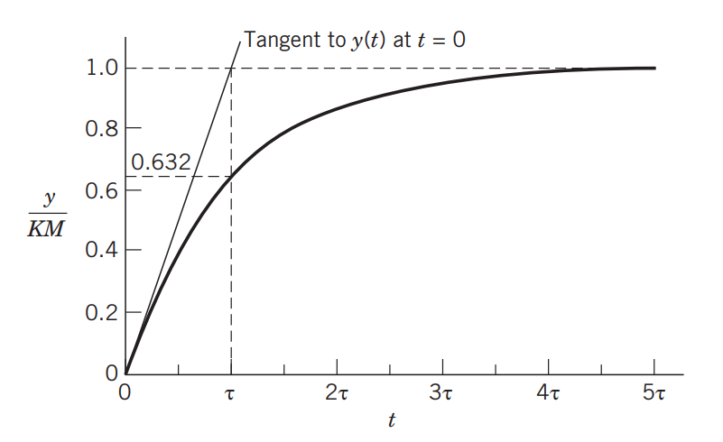

**Source:**

Seborg, D. E., Edgar, T. F., Mellichamp, D. A., & Doyle III, F. J. (2016). Process dynamics and control. John Wiley & Sons.

---

[CONTENT OMITTED]

# Chapter 5 Dynamic Behavior of First-Order and Second-Order Processes

[CONTENT OMITTED]

### 5.2.1 Step Response

For a step input of magnitude $M$, $U(s) = M / s$, and Eq. 5-14 becomes:

$$
Y(s) = \frac{K M}{s(\tau s + 1)} \qquad \text{(5-15)}
$$

Using Table 3.1, the time-domain response is:

$$
y(t) = K M \left(1 - e^{-t/\tau}\right) \qquad \text{(5-16)}
$$

The plot of this equation in Fig. 5.3 shows that a first-order process does not respond instantaneously to a sudden change in its input. In fact, after a time interval equal to the time constant ($t = \tau$), the process response is still only 63.2% complete. Theoretically, the process output never reaches the new steady-state value except as $t \to \infty$; it does approximate the final steady-state value when $t \approx 5\tau$, as shown in Table 5.1. Notice that Fig. 5.3 has been drawn in dimensionless or normalized form, with time divided by the time constant and the output change divided by the product of the process gain and magnitude of the input change. Now we consider a more specific example.

[CONTENT OMITTED]

# Chapter 7: Development of Empirical Models from Process Data

[CONTENT OMITTED]

## 7.2 Fitting First- and Second-Order Models Using Step Tests
A plot of the output response of a process to a step change in input is sometimes referred to as the *process reaction curve*. If the process of interest can beapproximated by a first-order or second-order linear
model, the model parameters can be obtained by inspection of the process reaction curve. For example, recall
the first-order model expressed in deviation variables, 

$$
T\frac{\mathrm{d}y}{dt} + y = Ku \qquad \text{(7-10)}
$$

where the system is initially at a steady state, with $u(0) = 0$ and $y(0) = 0$. If the input $u$ is abruptly changed from $0$ to $M$ at time $t = 0$, the step response in Eq. 5-16 results. The normalized step response is shown in Fig. 7.3. The response $y(t)$ reaches $63.2\%$ of its final value at $t = T$. The steady-state change in $y$, $\Delta y$, is given by $\Delta y = K M$. Rearranging Eq. 5-16 and taking the limit as $t \to 0$, the initial slope of the normalized step response is

$$
\left. \frac{d}{dt} \left( \frac{y}{K M} \right) \right|_{t=0} = \frac{1}{\tau} \qquad \text{(7-11)}
$$

Thus, as shown in Fig. 7.3, the intercept of the tangent at $t = 0$ with the horizontal line $y/(K M) = 1$ occurs at $t = \tau$. As an alternative, $\tau$ can be estimated from a step response plot by finding the time $t$ at which the response reaches $63.2\%$ of its final value, as illustrated in the following example.

**Figure 7.3.** Step response of a first-order system and graphical
constructions used to estimate the time constant, $\tau$.

[CONTENT OMITTED]

### 8.2.4. Proportional-Integral-Derivative Control

Now we consider the combination of the proportional, integral, and derivative control modes as a PID controller. PI and PID control have been the dominant control techniques for process control for many decades. For example, a survey indicated that large-scale continuous processes typically have between 500 and 5,000 feedback controllers for individual process variables such as flow rate and liquid level (Desborough and Miller, 2002). Of these controllers, 97% utilize some form of PID control.

Many variations of PID control are used in practice; next, we consider the three most common forms

#### Parallel Form of PID Control

The *parallel form* of the PID control algorithm (without a derivative filter) is given by:

$$
p(t) = p_0 + K_c \left[ e(t) + \frac{1}{\tau_I} \int_0^t e(t^*)\,dt^* + \tau_D \frac{de(t)}{dt} \right] \qquad \text{(8-13)}
$$

The corresponding transfer function is:

$$
\frac{P'(s)}{E(s)} = K_c \left[ 1 + \frac{1}{\tau_I s} + \tau_D s \right] \qquad \text{(8-14)}
$$

Figure 8.11 illustrates that this controller can be viewed as three separate elements operating in parallel on $E(s)$. The parallel-form PID controller, with and without a derivative filter, is shown in Table 8.1.

#### Series Form of PID Control

Historically, it was convenient to construct early analog controllers (both electronic and pneumatic) so that a PI element and a PD element operated in series. The *series form* of PID control without a derivative filter is shown in Fig. 8.12. In principle, it makes no difference whether the PD element or the PI element comes first.

Commercial versions of the series-form controller have a derivative filter that is applied to either the derivative term, as in Eq. 8-12, or to the PD term, as in Eq. 8-15:

$$
\frac{P'(s)}{E(s)} = K_c \left( \frac{\tau_I s + 1}{\tau_I s} \right) \left( \frac{\tau_D s + 1}{\alpha \tau_D s + 1} \right) \qquad \text{(8-15)}
$$

The consequences of adding a derivative filter are analyzed in Exercise 14.16.

#### Expanded Form of PID Control

The *expanded form* of PID control is:

$$
p(t) = \bar{p} + K_c e(t) + K_I \int_0^t e(t^*)\,dt^* + K_D \frac{de(t)}{dt} \qquad \text{(8-16)}
$$

Note that the controller parameters for the expanded form are three “gains,” $K_c$, $K_I$, and $K_D$, rather than the standard parameters, $K_c$, $τ_I$, and $τ_D$. The expanded form of PID control is used in MATLAB. This form might appear to be well suited for controller tuning, because each gain independently influences only one control mode. But the well-established controller tuning relations presented in Chapters 12 and 14 were developed for the series and parallel forms. Thus, there is little advantage in using the expanded form in Eq. 8-16, except for simulation.

[CONTENT OMITTED]

---
# Chapeter 12: PID Controller Design, Tuning, and Troubleshooting

[CONTENT OMITTED]

### 12.3.1 IMC Tuning Relations

Different IMC tuning relations can be derived depending on the type of low-pass filter $f$ and time-delay approximation that are selected (Rivera et al., 1986; Chien and Fruehauf, 1990; Skogestad, 2003).  

Table 12.1 presents the PID controller tuning relations for the parallel form that were derived by Chien and Fruehauf (1990) for common types of process models. The derivations are analogous to those for Example 12.2. The IMC filter $f$ was selected according to Eq. 12-21 with $r = 1$ for first-order and second-order models. For models with integrating elements, the following expression was employed:

$$
f = \frac{(2\tau_c - C)s + 1}{(\tau_c s + 1)^2} \quad \text{where} \quad C = \left. \frac{d\tilde{G}_+}{ds} \right|_{s=0} \qquad{\text{(12-32)}}
$$

In Table 12.1, two controllers are listed for some process models (cf. controllers $G$ and $H$, and $M$ and $N$). For these models, the PI controller in the first row was derived based on the time-delay approximation in Eq. 12-24b, while the PID controller in the next row was derived based on Eq. 12-24a.

Chien and Fruehauf (1990) have reported the equivalent tuning relations for the series form of the PID controller in Chapter 8. The controller settings for the parallel form can easily be converted to the corresponding settings for the series form, and vice versa, as shown in Table 12.2.

**Table 12.1** IMC Controller Settings for Parallel-Form PID Controller (Chien and Fruehauf, 1990)

| Case | Model | $K_c K$ | $\tau_I$ | $\tau_D$ |
|------|-------|---------|----------|----------|
| A | $\dfrac{K}{\tau s + 1}$ | $\tau$ | $\tau_c$ | $-$ |
| B | $\dfrac{K}{(\tau_1 s + 1)(\tau_2 s + 1)}$ | $\tau_1 + \tau_2$ | $\tau_c$ | $\dfrac{\tau_1 \tau_2}{\tau_1 + \tau_2}$ |
| C | $\dfrac{K}{\tau^2 s^2 + 2\zeta \tau s + 1}$ | $2\zeta\tau$ | $\tau_c$ | $\dfrac{2\zeta\tau^2}{2\zeta\tau}$ |
| D | $K(-\beta s + 1)/(\tau^2 s^2 + 2\zeta \tau s + 1),\ \beta > 0$ | $2\zeta\tau$ | $\tau_c + \beta$ | $\dfrac{2\zeta\tau^2}{2\zeta\tau}$ |
| E | $\dfrac{K}{s}$ | $2$ | $\tau_c$ | $2\tau_c$ |
| F | $\dfrac{K}{s(\tau s + 1)}$ | $2\tau_c + \tau$ | $\dfrac{\tau^2}{2\tau_c + \tau}$ | $\dfrac{2\tau_c\tau}{2\tau_c + \tau}$ |
| G | $\dfrac{K e^{-\theta s}}{\tau s + 1}$ | $\tau$ | $\tau_c + \theta$ | $-$ |
| H | $\dfrac{K e^{-\theta s}}{\tau s + 1}$ | $\tau + \dfrac{\theta}{2}$ | $\tau_c + \dfrac{\theta}{2}$ | $\dfrac{\tau\theta}{2\tau + \theta}$ |
| I | $\dfrac{K(\tau_3 s + 1)e^{-\theta s}}{(\tau_1 s + 1)(\tau_2 s + 1)}$ | $\tau_1 + \tau_2 - \tau_3$ | $\tau_c + \theta$ | $\dfrac{\tau_1\tau_2 - (\tau_1 + \tau_2 - \tau_3)\tau_3}{\tau_1 + \tau_2 - \tau_3}$ |
| J | $\dfrac{K(\tau_3 s + 1)e^{-\theta s}}{\tau^2 s^2 + 2\zeta \tau s + 1}$ | $2\zeta\tau - \tau_3$ | $\tau_c + \theta$ | $\dfrac{\tau^2 - (2\zeta\tau - \tau_3)\tau_3}{2\zeta\tau - \tau_3}$ |
| K | $\dfrac{K(-\tau_3 s + 1)e^{-\theta s}}{(\tau_1 s + 1)(\tau_2 s + 1)}$ | $\tau_1 + \tau_2 + \tau_3\theta$ | $\tau_c + \tau_3 + \theta$ | $\dfrac{\tau_3\theta + \tau_1\tau_2}{\tau_1 + \tau_2 + \tau_3\theta}$ |
| L | $\dfrac{K(-\tau_3 s + 1)e^{-\theta s}}{\tau^2 s^2 + 2\zeta \tau s + 1}$ | $2\zeta\tau + \tau_3\theta$ | $\tau_c + \tau_3 + \theta$ | $\dfrac{\tau_3\theta + \tau^2}{2\zeta\tau + \tau_3\theta}$ |
| M | $\dfrac{K e^{-\theta s}}{s}$ | $2\tau_c + \theta$ | $(\tau_c + \theta)^2$ | $-$ |
| N | $\dfrac{K e^{-\theta s}}{s}$ | $2\tau_c + \theta$ | $\left(\tau_c + \dfrac{\theta}{2}\right)^2$ | $\dfrac{\tau_c\theta + \theta^2/4}{2\tau_c + \theta}$ |
| O | $\dfrac{K e^{-\theta s}}{s(\tau s + 1)}$ | $2\tau_c + \tau + \theta$ | $(\tau_c + \theta)^2$ | $\dfrac{(2\tau_c + \theta)\tau}{2\tau_c + \tau + \theta}$ |

*Notes:*
- $\tau_c$ is the closed-loop time constant (IMC tuning parameter).
- $K$ is the process gain, $\tau$, $\tau_1$, $\tau_2$, $\tau_3$ are time constants, $\theta$ is the process dead time, $\zeta$ is the damping ratio, and $\beta$ is a model parameter.
- Some entries are simplified for clarity; refer to the original source for detailed derivations.

[CONTENT OMITTED]

#### Lambda Method

The Lambda method is a popular tuning technique, especially in the pulp and paper industry. Its PI or PID controller tuning is based on a simple transfer function model and the desired closed-loop transfer function in Eq. 12-6. The traditional approach is to tune a PI controller based on an FOPTD model or an integrator-plus-time-delay model. However, the Lambda method can also be used to tune PID controllers for these models (Åström and Hägglund, 2006).

It is noteworthy that the Lambda and IMC methods produce identical PI and PID controllers for these models and desired closed-loop transfer functions (see Table 12.1). Consequently, the Lambda tuning rules can be considered to be special cases of the IMC tuning rules.5

*5The term “Lambda method” was used because $\lambda$ was the symbol for the reciprocal of the desired closed-loop time constant in early publications (e.g., Dahlin, 1986).*

[CONTENT OMITTED]

### 12.5.1 Continuous Cycling Method
In 1942, Ziegler and Nichols published a classic paper that introduced their continuous cycling method for on-line controller tuning (Ziegler and Nichols, 1942). This paper and its Ziegler–Nichols (Z-N) tuning relations have had an enormous impact on both process control research and practice. Despite serious shortcomings, the Z-N relations and various modifications have been widely used as a benchmark in comparisons of tuning relations. Consequently, we briefly describe the Z-N continuous cycling method in this section before considering a more recent on-line tuning method, relay auto-tuning, in Section 12.5.2.

The Z-N continuous cycling method is based on experimentally determining the closed-loop stability limit for proportional-only control. The following trial and error procedure is used:

- **Step 1.** After the process has reached steady state
(at least approximately), introduce proportional-only
control by eliminating the integral and derivative
modes (i.e., set $\tau_\mathrm{D} = 0$ and $\tau_\mathrm{I} = \infty$)
- **Step 2.** Introduce a small, momentary set-point
change so that the controlled variable moves away
from the set point. Gradually increase $K_\mathrm{c}$ (in absolute value) in small increments until continuous cycling occurs. The term continuous cycling refers to a sustained oscillation with a constant amplitude. The value of $K_\mathrm{c}$ that produces continuous cycling (for proportional-only control) is defined to be the ultimate gain, $K_\mathrm{cu}$. The period of this sustained oscillation is the ultimate period, $P_{u}$.

After $K_\mathrm{cu}$ and $P_{u}$ have been determined, the controller settings can be calculated using the Z-N tuning relations in Table 12.7.

**Table 12.7** Controller Settings based on the Continuous
Cycling Method of Ziegler and Nichols (1942)

| Controller      | $K_\mathrm{c}$           | $\tau_\mathrm{I}$ | $\tau_\mathrm{D}$ |
|-----------------|--------------------------|----------------|----------------|
| P               | $0.5  K_\mathrm{cu}$     | $-$            | $-$            |
| PI              | $0.45 K_\mathrm{cu}$     | $P_{u} / 1.2$  | $-$            |
| PID             | $0.6  K_\mathrm{cu}$     | $P_{u} / 2$    | $P_{u} / 8$    |

The Z-N tuning relations were determined empirically to provide closed-loop responses with a 1/4 decay ratio. For proportional control, the Z-N settings in Table 12.7 provide a safety margin of two, because $K_\mathrm{c}$ is set to one-half of the stability limit, $K_\mathrm{cu}$ (i.e., $K_\mathrm{c} = 0.5 K_\mathrm{cu}$). When integral action is added for PI control, $K_\mathrm{c}$ is reduced from $0.5 K_\mathrm{cu}$ to $0.45 K_\mathrm{cu}$ (i.e., $K_\mathrm{c} = 0.45 K_\mathrm{cu}$). The stabilizing effect of derivative action allows $K_\mathrm{c}$ to be increased to $0.6 K_\mathrm{cu}$ for PID control (i.e., $K_\mathrm{c} = 0.6 K_\mathrm{cu}$).

The continuous cycling method has two major disadvantages:

1.  The trial-and-error determination of Kcu and Pu
can be quite time consuming if the process dynamics are slow.

2.  For many applications, continuous cycling is objectionable because the process is pushed to a stability limit. Consequently, if external disturbances or process changes occur during the test, unstable operation or a hazardous situation could result (e.g., a “runaway” chemical reaction).

The Z-N controller settings have been widely used as a benchmark for evaluating different tuning methods and control strategies. Because they are based on a 1/4 decay ratio, the Z-N settings tend to produce oscillatory responses and large overshoots for set-point changes.

Despite their prominence in the process control literature, it is not certain whether the famous Z-N tuning relations for PID control were developed for the series or parallel form of the controller (Åström et al., 2001). Because the parallel form results in a more conservative controller (Skogestad, 2003), it is reasonable to calculate the Z-N settings for the parallel form and then convert them to series form, if necessary, using Table 12.2.

[CONTENT OMITTED]
